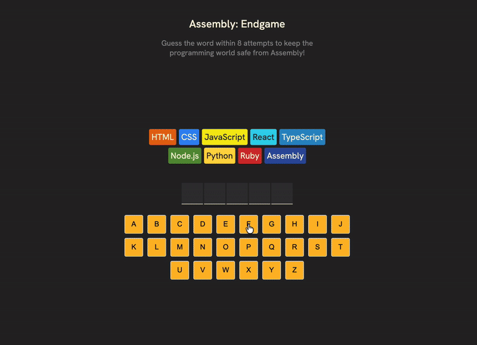

# Assembly: Endgame

A word-guessing game built with React where you must guess the correct word to save the programming world from Assembly language!

## About

Assembly: Endgame is a Hangman-style game with a programming twist. Instead of drawing a hangman, each wrong guess eliminates a programming language from existence. Your mission is to guess the word before all 8 languages are lost to Assembly!

## Screenshot



## Features

-   **Interactive Gameplay**: Click letter buttons to make your guesses
-   **Visual Feedback**: Color-coded keyboard shows correct (green) and incorrect (red) guesses
-   **Language Chips**: Watch programming languages disappear with each wrong guess
-   **Accessibility**: Screen reader support with ARIA live regions for game status updates
-   **Celebration**: Confetti animation when you win!
-   **Responsive Design**: Works on desktop and mobile devices

## How to Play

1. You have 8 attempts to guess the hidden word
2. Click letter buttons to guess
3. Correct letters will appear in the word
4. Wrong guesses eliminate programming languages one by one
5. Guess the complete word before all languages are lost to win!

## Tech Stack

-   **React** - UI framework with hooks for state management
-   **clsx** - Utility for conditional CSS classes
-   **react-confetti** - Victory celebration effects
-   **build tools** - lightweight, manual React bundler with SCSS compilation and static dev server

## Getting Started

### Prerequisites

-   Node.js (v14 or higher)
-   npm or yarn

### Installation

```bash
# Clone the repository
git clone https://github.com/yourusername/assembly-endgame.git

# Navigate to project directory
cd assembly-endgame

# Install dependencies
npm install

# Start development server
npm run dev
```

## Project Structure

```
assembly-endgame/
├── src/
│   ├── AssemblyEndgame.jsx   # Main game component
│   ├── languages.js          # Programming language data
│   └── utils.js              # Helper functions (word selection, farewell messages)
├── public/
└── package.json
```

## Game Logic

-   Each wrong guess costs you one programming language
-   The game tracks guessed letters and displays them appropriately
-   Win condition: All letters in the word are guessed
-   Lose condition: 8 wrong guesses (all languages lost)

## Customisation

You can easily customise the game by modifying:

-   **Word list**: Update the word array in `utils.js`
-   **Languages**: Modify the languages array in `languages.js`
-   **Difficulty**: Adjust the number of allowed wrong guesses by changing the languages array length
-   **Styling**: Update CSS to match your preferred theme

## Accessibility

This game includes accessibility features:

-   ARIA live regions announce game status to screen readers
-   Keyboard buttons have proper aria-labels
-   Disabled state management for used letters
-   Semantic HTML structure

## Contributing

Contributions, issues, and feature requests are welcome! Feel free to check the issues page.

## Acknowledgments

Inspired by the classic Hangman game with a fun programming theme!

## License

MIT License

Copyright (c) 2025 Alex Grigore agworksbox@gmail.com

Permission is hereby granted, free of charge, to any person obtaining a copy of this software and associated documentation files (the "Software"), to deal in the Software without restriction, including without limitation the rights to use, copy, modify, merge, publish, distribute, sublicense, and/or sell copies of the Software, and to permit persons to whom the Software is furnished to do so, subject to the following conditions:

The above copyright notice and this permission notice shall be included in all copies or substantial portions of the Software.

THE SOFTWARE IS PROVIDED "AS IS", WITHOUT WARRANTY OF ANY KIND, EXPRESS OR IMPLIED, INCLUDING BUT NOT LIMITED TO THE WARRANTIES OF MERCHANTABILITY, FITNESS FOR A PARTICULAR PURPOSE AND NONINFRINGMENT. IN NO EVENT SHALL THE AUTHORS OR COPYRIGHT HOLDERS BE LIABLE FOR ANY CLAIM, DAMAGES OR OTHER LIABILITY, WHETHER IN AN ACTION OF CONTRACT, TORT OR OTHERWISE, ARISING FROM, OUT OF OR IN CONNECTION WITH THE SOFTWARE OR THE USE OR OTHER DEALINGS IN THE SOFTWARE.
